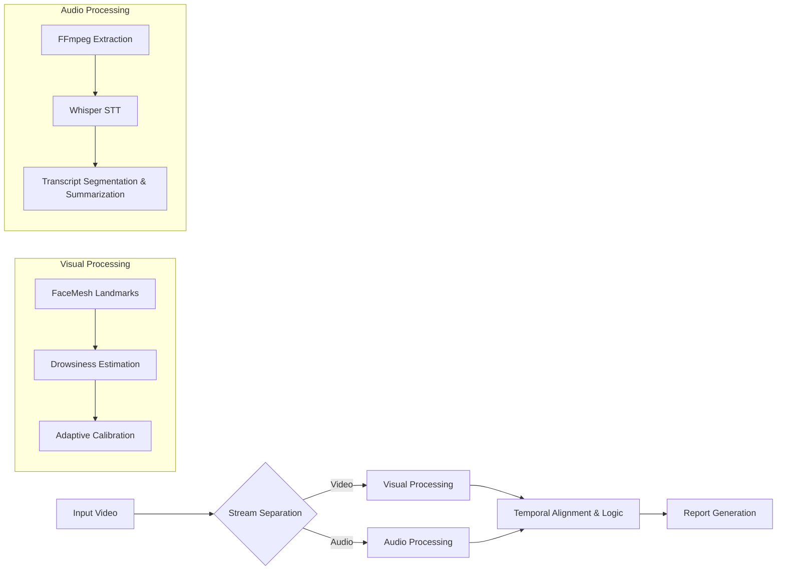

# Multimodal Focus Analytics Pipeline

[](https://arxiv.org/abs/23XX.XXXXX)
[](https://www.python.org/downloads/)
[](https://opensource.org/licenses/MIT)
[](https://developers.google.com/mediapipe)
[](https://github.com/openai/whisper)

> A multimodal system for detecting focus drop intervals in lecture videos and recovering missed content via automated summarization.

---

## Abstract

Students frequently lose critical information during recorded lectures due to fluctuating attention levels.
This repository implements **A Multimodal Pipeline for Detecting Focus Drop Intervals and Recovering Missed Lecture Content**.

Unlike traditional review tools that require manual searching, this system adopts a **video–audio multimodal approach** to:

- Detect physiological indicators of reduced attention (eye closure, blink rate, head pose)
- Align focus-drop intervals with timestamped speech-to-text transcripts
- Recover missed lecture content via automated summarization
- Generate a structured PDF report for post-lecture review

---

## System Architecture

The pipeline processes visual and audio streams independently before temporal fusion.



## Code Structure

```
multimodal-focus-analytics/
├── data/
│   ├── input_videos/
│   │   └── lecture.mp4
│   ├── audio/
│   │   └── lecture.wav
│   └── transcripts/
│       └── lecture.json
│
├── visual/
│   ├── face_mesh.py
│   ├── eye_aspect_ratio.py
│   └── drowsiness_model.py
│
├── audio/
│   ├── extract_audio.py
│   ├── whisper_stt.py
│   └── summarizer.py
│
├── fusion/
│   ├── align_timestamps.py
│   └── focus_logic.py
│
├── report/
│   ├── pdf_generator.py
│   └── templates/
│
├── main.py
├── requirements.txt
└── README.md
```

## Installation
```
git clone https://github.com/your-username/multimodal-focus-analytics.git
cd multimodal-focus-analytics
```

```
python -m venv venv
source venv/bin/activate      # macOS / Linux
venv\Scripts\activate         # Windows
```

```
pip install -r requirements.txt
```

FFmpeg must be installed separately.
```
# macOS
brew install ffmpeg
```
```
# Ubuntu / Debian
sudo apt install ffmpeg
```

## requirements.txt

```
python>=3.8
opencv-python
mediapipe
numpy
scipy
ffmpeg-python
librosa
openai-whisper
torch
transformers
sentencepiece
tqdm
pandas
reportlab
jinja2
```

## Usage

```
python main.py \
  --video data/input_videos/lecture.mp4 \
  --output outputs/
```

## Optional Arguments

```
python main.py \
  --video data/input_videos/lecture.mp4 \
  --ear-threshold 0.25 \
  --pitch-threshold 15 \
  --min-drop-duration 5 \
  --summarize-model t5-small \
  --output outputs/
```

## Citations

```
@article{focusanalytics2024,
  title={A Multimodal Pipeline for Detecting Focus Drop Intervals and Recovering Missed Lecture Content},
  author={Anonymous},
  journal={arXiv preprint arXiv:23XX.XXXXX},
  year={2024}
}
```
